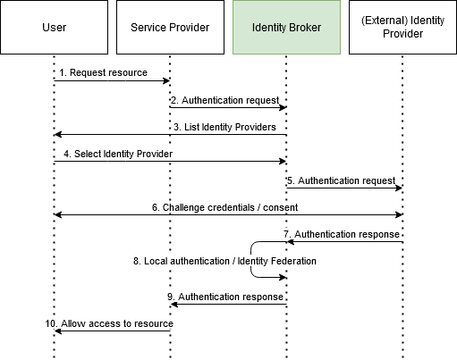

## [Identity Brokering](https://www.keycloak.org/docs/latest/server_admin/#_identity_broker)

An `Identity Broker` connects service providers with different identity providers.  
It creates trust with an external identity provider.  

Existing accounts can be linked to Keycloak such as `Google`, `Facebook` or `Twitter`.  

Common identity provider protocols:
* `SAML v2.0`
* `OpenID Connect v1.0`
* `OAuth v2.0`

### Brokering Overview

Keycloak as an identity broker presents users with a list of identity providers.
You can also configure a default identity provider.  

  </a>

The Flow:
* when a user requests a proteted resource they are redirected to an identity provider
* when the user logs in they are redirected back to Keycloak with a security token
* Keycloak check if the token is to be trusted and optionally federates or account links the user
* Keycloak issues a token that the user can use to access the requested protected resource

Client applications are decoupled from external identity providers because Keycloak issues its own security token.  

### Default Identity Provider
Edit this section
Report an issue

It is possible to automatically redirect to a identity provider instead of displaying the login form. To enable this go to the Authentication page in the administration console and select the Browser flow. Then click on config for the Identity Provider Redirector authenticator. Set Default Identity Provider to the alias of the identity provider you want to automatically redirect users to.

If the configured default identity provider is not found the login form will be displayed instead.

This authenticator is also responsible for dealing with the kc_idp_hint query parameter. See client suggested identity provider section for more details.
General Configuration
Edit this section
Report an issue

The identity broker configuration is all based on identity providers. Identity providers are created for each realm and by default they are enabled for every single application. That means that users from a realm can use any of the registered identity providers when signing in to an application.

In order to create an identity provider click the Identity Providers left menu item.
Identity Providers

identity providers

In the drop down list box, choose the identity provider you want to add. This will bring you to the configuration page for that identity provider type.
Add Identity Provider

add identity provider

Above is an example of configuring a Google social login provider. Once you configure an IDP, it will appear on the Keycloak login page as an option.
IDP login page

identity provider login page

Social

* Social providers allow you to enable social authentication in your realm. Keycloak makes it easy to let users log in to your application using an existing account with a social network. Currently supported providers include: Twitter, Facebook, Google, LinkedIn, Instagram, Microsoft, PayPal, Openshift v3, GitHub, GitLab, Bitbucket, and Stack Overflow.
Protocol-based

* Protocol-based providers are those that rely on a specific protocol in order to authenticate and authorize users. They allow you to connect to any identity provider compliant with a specific protocol. Keycloak provides support for SAML v2.0 and OpenID Connect v1.0 protocols. It makes it easy to configure and broker any identity provider based on these open standards.

Although each type of identity provider has its own configuration options, all of them share some very common configuration. Regardless of which identity provider you are creating, you’ll see the following configuration options available:
Table 1. Common Configuration Configuration 	Description

Alias

The alias is a unique identifier for an identity provider. It is used to reference an identity provider internally. Some protocols such as OpenID Connect require a redirect URI or callback url in order to communicate with an identity provider. In this case, the alias is used to build the redirect URI. Every single identity provider must have an alias. Examples are facebook, google, idp.acme.com, etc.

Enabled

Turn the provider on/off.

Hide on Login Page

When this switch is on, this provider will not be shown as a login option on the login page. Clients can still request to use this provider by using the 'kc_idp_hint' parameter in the URL they use to request a login.

Account Linking Only

When this switch is on, this provider cannot be used to login users and will not be shown as an option on the login page. Existing accounts can still be linked with this provider though.

Store Tokens

Whether or not to store the token received from the identity provider.

Stored Tokens Readable

Whether or not users are allowed to retrieve the stored identity provider token. This also applies to the broker client-level role read token.

Trust Email

If the identity provider supplies an email address this email address will be trusted. If the realm required email validation, users that log in from this IDP will not have to go through the email verification process.

GUI Order

The order number that sorts how the available IDPs are listed on the login page.

First Login Flow

This is the authentication flow that will be triggered for users that log into Keycloak through this IDP for the first time ever.

Post Login Flow

Authentication flow that is triggered after the user finishes logging in with the external identity provider.

Sync Mode

Strategy of how to update user information from the idp through mappers: When choosing legacy, the current behavior is kept, import will never update user data, while force will always update user data when possible. See also the documentation for Identity Provider Mappers for more details.
Social Identity Providers
Edit this section
Report an issue

For Internet facing applications, it is quite burdensome for users to have to register at your site to obtain access. It requires them to remember yet another username and password combination. Social identity providers allow you to delegate authentication to a semi-trusted and respected entity where the user probably already has an account. Keycloak provides built-in support for the most common social networks out there, such as Google, Facebook, Twitter, GitHub, LinkedIn, Microsoft and Stack Overflow
